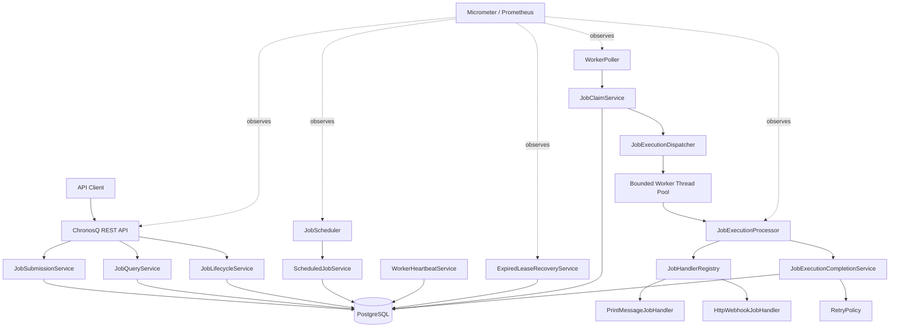
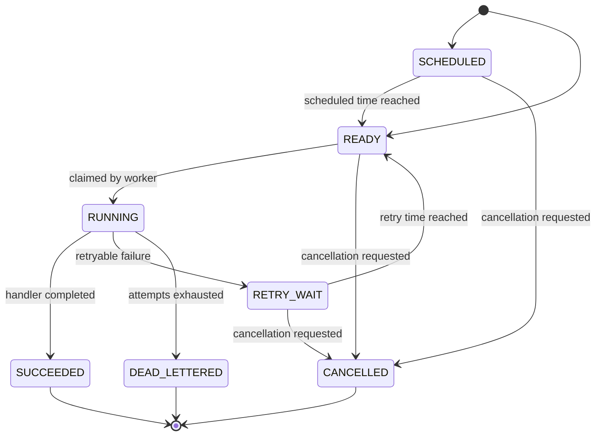

# ChronosQ — Persistent Distributed Job Scheduler

ChronosQ is a persistent, distributed background-job processing platform built with Java, Spring Boot and PostgreSQL.

It accepts jobs through REST APIs, stores them durably, schedules them for future execution and safely distributes them across multiple worker instances. ChronosQ supports priority queues, retries, worker leases, crash recovery, execution history, dead-letter handling and production monitoring.

---

## Key Features

- Immediate, one-time and fixed-interval jobs
- Persistent PostgreSQL-backed job storage
- REST APIs for submission, querying and cancellation
- JSON job payloads
- Multiple named queues
- Priority-based execution
- Idempotent job submission
- Safe multi-worker job claiming
- Configurable worker thread pools
- Exponential-backoff retries
- Dead-letter handling
- Worker registration and heartbeats
- Lease-based crash recovery
- Execution timeouts
- Job execution history
- Prometheus metrics
- Spring Boot health checks
- Graceful shutdown
- Flyway database migrations
- Testcontainers integration testing

---

## Technology Stack

| Technology | Usage |
|---|---|
| Java 21 | Primary programming language |
| Spring Boot 4 | Application framework |
| Spring MVC | REST API development |
| Spring JDBC | Explicit SQL-based persistence |
| PostgreSQL 17 | Durable job storage and distributed coordination |
| Flyway | Version-controlled database migrations |
| Docker Compose | Local infrastructure |
| HikariCP | Database connection pooling |
| Jackson 3 | JSON payload processing |
| Jakarta Validation | API and configuration validation |
| Micrometer | Application metrics |
| Prometheus | Metrics collection |
| Spring Boot Actuator | Health and operational endpoints |
| JUnit 5 | Automated testing |
| Mockito | Unit-test mocking |
| AssertJ | Readable test assertions |
| Testcontainers | PostgreSQL integration testing |
| Maven | Dependency and build management |
| Lombok | Logging boilerplate reduction |

---

## System Architecture



---

## How ChronosQ Works

### 1. Job submission

A client submits a job through the REST API.

ChronosQ:

1. Validates the request.
2. Checks the idempotency key.
3. Calculates when the job should become available.
4. Stores the job in PostgreSQL.
5. Returns the created job to the client.

### 2. Scheduling

Jobs can be:

- `IMMEDIATE`
- `ONE_TIME`
- `FIXED_INTERVAL`

Immediate jobs begin in `READY`.

Future jobs begin in `SCHEDULED`. The scheduler periodically moves due jobs from `SCHEDULED` to `READY`.

### 3. Distributed claiming

Each worker periodically requests ready jobs from PostgreSQL.

ChronosQ uses:

```sql
FOR UPDATE SKIP LOCKED
```

This lets multiple workers claim different jobs concurrently without blocking each other.

During claiming, ChronosQ:

- Changes the job to `RUNNING`
- Assigns the worker ID
- Increments the attempt number
- Creates a lease expiration time
- Creates an execution-history record

### 4. Background execution

The claimed job is submitted to a bounded thread pool.

The execution processor:

1. Reads the job type.
2. Finds the correct handler.
3. Executes the handler.
4. Measures execution duration.
5. Captures failures and timeout information.
6. Produces an execution result.

### 5. Completion or retry

When execution succeeds:

- The execution becomes `SUCCEEDED`.
- The job becomes `SUCCEEDED`.
- Fixed-interval jobs calculate their next execution time.

When execution fails:

- ChronosQ evaluates the retry policy.
- Retryable jobs become `RETRY_WAIT`.
- The next execution time is calculated using exponential backoff.
- Jobs that exhaust their attempts become `DEAD_LETTERED`.

### 6. Worker crash recovery

Every worker periodically sends a heartbeat.

If a worker crashes:

- Its heartbeat becomes stale.
- Its job leases eventually expire.
- The recovery scheduler finds expired jobs.
- Abandoned executions are recorded.
- Recoverable jobs return to `READY` or `RETRY_WAIT`.
- Exhausted jobs move to `DEAD_LETTERED`.

---

## Job State Machine



All state changes are validated by `JobStateMachine`.

Terminal states are:

- `SUCCEEDED`
- `DEAD_LETTERED`
- `CANCELLED`

---

## Supported Job Handlers

### `PRINT_MESSAGE`

Writes a message from the job payload to the application log.

Example payload:

```json
{
  "message": "Hello from ChronosQ"
}
```

### `HTTP_WEBHOOK`

Sends an HTTP request to an external endpoint.

Example payload:

```json
{
  "url": "https://example.com/webhooks/orders",
  "method": "POST",
  "headers": {
    "X-Source": "chronosq"
  },
  "body": {
    "orderId": "order-1001",
    "status": "READY"
  }
}
```

Additional handlers can be added by implementing:

```java
public interface JobHandler {

    String jobType();

    void execute(Job job) throws Exception;
}
```

Spring automatically provides registered handlers to `JobHandlerRegistry`.

---

## REST API

Base URL:

```text
http://localhost:8080/api/v1
```

### Submit a job

```http
POST /api/v1/jobs
Content-Type: application/json
```

Example immediate job:

```json
{
  "queueName": "default",
  "jobType": "PRINT_MESSAGE",
  "payload": {
    "message": "Hello from ChronosQ"
  },
  "scheduleType": "IMMEDIATE",
  "priority": 5,
  "maxAttempts": 3,
  "timeoutSeconds": 30,
  "idempotencyKey": "welcome-message-001"
}
```

Example one-time job:

```json
{
  "queueName": "notifications",
  "jobType": "HTTP_WEBHOOK",
  "payload": {
    "url": "https://example.com/webhook",
    "method": "POST",
    "body": {
      "event": "REMINDER"
    }
  },
  "scheduleType": "ONE_TIME",
  "scheduledAt": "2026-08-10T10:30:00Z",
  "priority": 10,
  "maxAttempts": 5,
  "timeoutSeconds": 20
}
```

Example fixed-interval job:

```json
{
  "queueName": "maintenance",
  "jobType": "PRINT_MESSAGE",
  "payload": {
    "message": "Periodic maintenance check"
  },
  "scheduleType": "FIXED_INTERVAL",
  "intervalSeconds": 300,
  "priority": 0,
  "maxAttempts": 3,
  "timeoutSeconds": 30
}
```

Successful response:

```http
HTTP/1.1 201 Created
```

### Get job details

```http
GET /api/v1/jobs/{jobId}
```

### Get execution history

```http
GET /api/v1/jobs/{jobId}/executions
```

### Cancel a job

```http
POST /api/v1/jobs/{jobId}/cancel
```

Jobs that have already reached a terminal state cannot be cancelled.

---

## Database Design

### `jobs`

Stores the current state and configuration of every job.

Important columns:

| Column | Purpose |
|---|---|
| `id` | Unique job identifier |
| `queue_name` | Queue consumed by workers |
| `job_type` | Handler type |
| `payload` | JSON job data |
| `status` | Current job state |
| `priority` | Processing priority |
| `available_at` | Earliest execution time |
| `schedule_type` | Immediate, one-time or fixed interval |
| `interval_seconds` | Fixed-interval duration |
| `attempt_count` | Number of started attempts |
| `max_attempts` | Maximum permitted attempts |
| `idempotency_key` | Prevents duplicate submission |
| `locked_by` | Worker currently owning the job |
| `lease_expires_at` | Worker-ownership expiration |
| `timeout_seconds` | Maximum execution duration |
| `version` | Optimistic-lock version |
| `created_at` | Creation timestamp |
| `updated_at` | Last update timestamp |
| `completed_at` | Terminal completion timestamp |

### `job_executions`

Stores one historical row for each attempt.

Important information includes:

- Execution ID
- Job ID
- Worker ID
- Attempt number
- Execution status
- Start and finish timestamps
- Execution duration
- Error type
- Error message

Execution statuses include:

- `RUNNING`
- `SUCCEEDED`
- `FAILED`
- `TIMED_OUT`
- `ABANDONED`

### `worker_nodes`

Stores information about running worker instances.

It contains:

- Worker ID
- Instance name
- Worker status
- Startup time
- Last heartbeat time

---

## Concurrency and Duplicate Protection

ChronosQ uses several layers of protection.

### Pessimistic row locking

```sql
FOR UPDATE SKIP LOCKED
```

Prevents two active workers from claiming the same database row simultaneously.

### Worker ownership

A running job records the worker that claimed it:

```text
locked_by = worker-1
```

Only the owning worker can normally complete that job.

### Lease expiration

Worker ownership is temporary:

```text
lease_expires_at = current time + lease duration
```

If the worker disappears, recovery begins after the lease expires.

### Optimistic locking

Every job contains a `version`.

Updates only succeed when the expected version still matches the stored version. This prevents stale application code from overwriting a newer change.

### Idempotency keys

Clients can provide an idempotency key when submitting a job.

Repeated requests with the same key return the existing job instead of creating multiple jobs.

---

## Delivery Guarantee

ChronosQ provides **at-least-once execution**.

This means ChronosQ prioritizes not losing accepted jobs. In rare crash situations, a handler may be executed more than once.

For example:

1. A webhook handler successfully contacts an external service.
2. The worker crashes before recording success in PostgreSQL.
3. The lease expires.
4. ChronosQ retries the job.

Therefore, handlers and external APIs should be idempotent whenever possible.

ChronosQ does not claim exactly-once execution because exactly-once external side effects cannot generally be guaranteed using only a local database transaction.

---

## Retry Policy

Retryable failures use exponential backoff.

Conceptually:

```text
delay = initial delay × 2^(attempt number - 1)
```

The delay is limited by a configurable maximum and may include jitter to stop many failed jobs from retrying simultaneously.

Example:

| Failed attempt | Approximate delay |
|---:|---:|
| 1 | 5 seconds |
| 2 | 10 seconds |
| 3 | 20 seconds |
| 4 | 40 seconds |

When the maximum attempt count is reached, the job moves to `DEAD_LETTERED`.

---

## Thread-Pool Backpressure

ChronosQ uses a bounded execution pool.

```yaml
chronosq:
  execution:
    thread-count: 8
    queue-capacity: 200
```

A bounded queue protects the JVM from accepting unlimited in-memory work.

If the thread pool and queue are full:

- New execution tasks are rejected safely.
- The rejection is recorded.
- The job is not silently lost.
- Retry or dead-letter rules are applied.

---

## Configuration

```yaml
spring:
  application:
    name: chronosq

  datasource:
    url: ${CHRONOSQ_DB_URL:jdbc:postgresql://localhost:5433/chronosq}
    username: ${CHRONOSQ_DB_USERNAME:chronosq}
    password: ${CHRONOSQ_DB_PASSWORD:chronosq}

    hikari:
      maximum-pool-size: ${CHRONOSQ_DB_POOL_SIZE:10}

  flyway:
    enabled: true
    locations: classpath:db/migration

  jackson:
    time-zone: UTC

server:
  port: ${SERVER_PORT:8080}
  shutdown: graceful

chronosq:
  scheduler:
    enabled: ${CHRONOSQ_SCHEDULER_ENABLED:true}
    poll-interval-ms: ${CHRONOSQ_SCHEDULER_INTERVAL_MS:1000}
    batch-size: ${CHRONOSQ_SCHEDULER_BATCH_SIZE:100}

  worker:
    enabled: ${CHRONOSQ_WORKER_ENABLED:true}
    worker-id: ${CHRONOSQ_WORKER_ID:worker-1}
    instance-name: ${CHRONOSQ_INSTANCE_NAME:local-instance}
    queue-name: ${CHRONOSQ_QUEUE_NAME:default}
    claim-batch-size: ${CHRONOSQ_CLAIM_BATCH_SIZE:10}
    lease-duration-seconds: ${CHRONOSQ_LEASE_SECONDS:60}

  execution:
    poll-interval-ms: ${CHRONOSQ_EXECUTION_POLL_MS:1000}
    thread-count: ${CHRONOSQ_EXECUTION_THREADS:8}
    queue-capacity: ${CHRONOSQ_EXECUTION_QUEUE_CAPACITY:200}

  retry:
    initial-delay-seconds: ${CHRONOSQ_RETRY_INITIAL_DELAY:5}
    maximum-delay-seconds: ${CHRONOSQ_RETRY_MAXIMUM_DELAY:300}

  recovery:
    enabled: ${CHRONOSQ_RECOVERY_ENABLED:true}
    poll-interval-ms: ${CHRONOSQ_RECOVERY_INTERVAL_MS:10000}

  heartbeat:
    interval-ms: ${CHRONOSQ_HEARTBEAT_INTERVAL_MS:5000}

management:
  endpoints:
    web:
      exposure:
        include: health,info,prometheus

  endpoint:
    health:
      show-details: always
      probes:
        enabled: true
```

Production credentials should always be supplied through environment variables or a secrets manager.

---

## Local Development

### Prerequisites

Install:

- Java 21 or newer
- Docker Desktop
- Git

Maven does not need to be installed separately because the repository contains Maven Wrapper.

### Clone the repository

```bash
git clone https://github.com/YOUR_USERNAME/chronosq.git
cd chronosq
```

### Start PostgreSQL

```bash
docker compose up -d
```

Check its status:

```bash
docker compose ps
```

Local PostgreSQL is available on:

```text
localhost:5433
```

### Start ChronosQ

Windows:

```powershell
.\mvnw.cmd spring-boot:run
```

macOS or Linux:

```bash
./mvnw spring-boot:run
```

ChronosQ starts on:

```text
http://localhost:8080
```

### Check application health

```text
http://localhost:8080/actuator/health
```

### View Prometheus metrics

```text
http://localhost:8080/actuator/prometheus
```

---

## Testing

Docker must be running because repository and integration tests use PostgreSQL Testcontainers.

Windows:

```powershell
.\mvnw.cmd test
```

macOS or Linux:

```bash
./mvnw test
```

The project contains:

- Domain-model unit tests
- State-machine transition tests
- Request-validation tests
- Repository integration tests
- Flyway migration tests
- REST API integration tests
- Scheduling tests
- Concurrent claiming tests
- Handler-registry tests
- Handler execution tests
- Retry-policy tests
- Recovery tests
- Worker-heartbeat tests
- Thread-pool rejection tests
- Execution completion tests
- Metrics tests

The exact number of tests should be added after running the final test suite. Do not claim a test count until it is measured from the generated test reports.

---

## Observability

ChronosQ exposes Spring Boot Actuator endpoints:

```text
/actuator/health
/actuator/info
/actuator/prometheus
```

Application metrics include:

- Jobs submitted
- Jobs claimed
- Jobs completed
- Jobs failed
- Jobs retried
- Jobs dead-lettered
- Jobs recovered after lease expiration
- Active workers
- Execution duration
- Claim-batch size
- Thread-pool activity
- Execution queue size
- Task rejection count

Logs include identifiers such as:

- Job ID
- Execution ID
- Worker ID
- Job type
- Queue name
- Attempt number

These identifiers make it easier to trace a job through the complete system.

---

## Health Checks

ChronosQ reports health for:

- Application availability
- PostgreSQL connectivity
- Liveness
- Readiness

Docker Compose also checks PostgreSQL using:

```text
pg_isready
```

---

## Graceful Shutdown

When ChronosQ receives a shutdown signal:

1. Spring stops accepting new work.
2. Scheduled polling stops.
3. The execution thread pool waits for active tasks.
4. Worker status is updated.
5. Application resources are closed safely.

Jobs that cannot finish before shutdown are later recovered through lease expiration.

---

## Security and Production Hardening

The production-ready configuration includes:

- Request validation
- Restricted Actuator exposure
- Externalized secrets
- Database connection-pool limits
- HTTP client connection and read timeouts
- Webhook URL validation
- Payload-size limits
- Graceful shutdown
- Structured error responses
- Database indexes for claim and recovery queries
- Bounded queues and thread pools
- Rate-limiting readiness
- Security headers
- Dependency and vulnerability scanning readiness

Authentication should be configured according to the deployment environment, such as API keys, OAuth2 or gateway-level authentication.

---

## Flyway Migrations

Database changes are stored under:

```text
src/main/resources/db/migration
```

Example:

```text
V1__create_jobs_table.sql
V2__create_job_executions_table.sql
V3__create_worker_nodes_table.sql
```

Flyway applies migrations automatically during application startup.

Never modify a migration that has already been applied in a shared environment. Create a new migration with the next version instead.

---

## Package Structure

```text
com.chronosq
├── api
│   ├── controllers
│   ├── request and response models
│   ├── mapping
│   └── exception handling
├── configuration
│   ├── scheduler configuration
│   ├── worker configuration
│   ├── execution configuration
│   ├── retry configuration
│   └── recovery configuration
├── execution
│   ├── execution domain model
│   ├── execution persistence
│   ├── dispatcher
│   ├── processor
│   └── completion service
├── handler
│   ├── handler contract
│   ├── handler registry
│   ├── print-message handler
│   └── HTTP-webhook handler
├── job
│   ├── domain
│   ├── repository
│   └── service
├── metrics
│   └── application metrics
├── recovery
│   ├── expired-lease detection
│   └── abandoned-job recovery
├── scheduler
│   ├── schedule calculation
│   ├── due-job promotion
│   └── scheduled polling
└── worker
    ├── worker registration
    ├── heartbeat
    ├── job claiming
    └── worker polling
```

---

## Implementation Phases

| Phase | Work completed |
|---|---|
| Phase 1 | Spring Boot foundation, PostgreSQL, Docker, Flyway and configuration |
| Phase 2 | Domain models, state machine, repositories and JDBC persistence |
| Phase 3 | REST APIs, validation, mapping and global error handling |
| Phase 4 | Immediate, one-time and fixed-interval scheduling |
| Phase 5 | Atomic distributed claiming using `SKIP LOCKED` and job leases |
| Phase 6 | Bounded worker execution engine and transactional completion |
| Phase 7 | Print-message and HTTP-webhook job handlers |
| Phase 8 | Retry policy, exponential backoff, heartbeat and crash recovery |
| Phase 9 | Micrometer metrics, Prometheus and operational visibility |
| Phase 10 | Security, hardening, concurrency testing and final documentation |

---

## Design Decisions

### Why PostgreSQL instead of an in-memory queue?

PostgreSQL provides durable storage, transactions, row locking, indexes and crash recovery. Accepted jobs survive application restarts.

### Why Spring JDBC instead of JPA?

Spring JDBC keeps locking and claiming queries explicit. This is useful because job claiming depends on database-specific SQL such as `FOR UPDATE SKIP LOCKED`.

### Why use a bounded thread pool?

An unlimited executor can consume all available memory when jobs arrive faster than they can be processed. A bounded queue creates backpressure.

### Why use leases?

A permanent worker lock would leave jobs stuck forever when a worker crashes. A lease makes worker ownership temporary and recoverable.

### Why use optimistic locking?

The version column prevents stale updates from silently replacing newer job state.

### Why provide at-least-once execution?

A database can atomically update its own rows, but it cannot atomically control every external side effect. At-least-once delivery combined with idempotent handlers is the practical reliability model.

---

## Production Readiness Checklist

- [x] Durable PostgreSQL storage
- [x] Versioned database migrations
- [x] REST request validation
- [x] Idempotent submission
- [x] Atomic distributed claiming
- [x] Optimistic locking
- [x] Worker leases
- [x] Bounded thread pool
- [x] Execution history
- [x] Retry and dead-letter handling
- [x] Worker heartbeat and recovery
- [x] Execution timeout handling
- [x] Metrics and health endpoints
- [x] Graceful shutdown
- [x] Unit tests
- [x] PostgreSQL integration tests
- [x] Concurrent-worker tests
- [x] Externalized production configuration
- [x] Final documentation

---

## Future Extensions

Possible future improvements include:

- Cron-expression scheduling
- Multiple queue subscriptions per worker
- Job dependencies and workflows
- Dead-letter replay API
- Administrative dashboard
- WebSocket job-status updates
- Per-tenant rate limits
- Horizontal autoscaling metrics
- OpenTelemetry tracing
- Job payload encryption
- PostgreSQL partitioning for large execution-history tables

---

## Learning Outcomes

ChronosQ demonstrates practical knowledge of:

- Java concurrency
- Spring Boot application design
- REST API design
- PostgreSQL transactions
- Pessimistic row locking
- Optimistic locking
- Distributed worker coordination
- State-machine modelling
- Retry and recovery patterns
- At-least-once delivery
- Idempotency
- Thread-pool backpressure
- Database integration testing
- Metrics and production observability

---

## Author

Built as a hands-on distributed-systems project using Java, Spring Boot and PostgreSQL.
