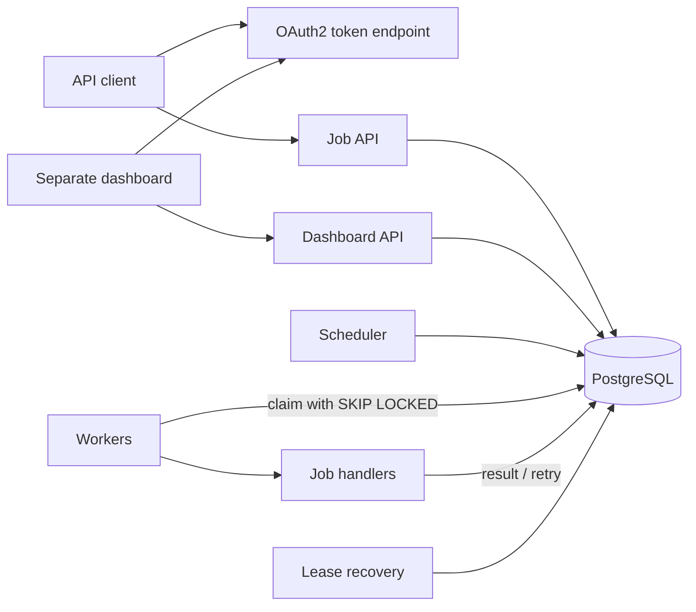

# ChronosQ

ChronosQ is a PostgreSQL-backed background job scheduler built with Java 21 and Spring Boot 4. It accepts jobs through a REST API, schedules and executes them across workers, and records every attempt. This is a learning and portfolio project focused on database coordination and failure recovery.

## What it does

- Runs immediate, one-time, fixed-interval, and cron jobs. Cron schedules use a time zone and a missed-execution policy: `SKIP`, `RUN_ONCE_IMMEDIATELY`, or `CATCH_UP_ALL`.
- Claims ready jobs across workers with PostgreSQL `FOR UPDATE SKIP LOCKED`, worker leases, and heartbeats.
- Retries eligible failures with backoff; exhausted jobs become dead-lettered. Execution attempts remain queryable.
- Lets an operator requeue a dead-lettered job as a new job. The original stays terminal; an audit record links both jobs and records who requeued it and why.
- Provides `PRINT_MESSAGE` and `HTTP_WEBHOOK` handlers, a bounded execution pool, and a read-only operational dashboard API.
- Issues OAuth2 client-credentials tokens and validates JWT scopes on the job and metrics APIs.

## Architecture


```mermaid
flowchart LR
    Client[API client] --> Auth[OAuth2 token endpoint]
    Client --> API[Job API]
    Dashboard[Separate dashboard] --> Auth
    Dashboard --> Metrics[Dashboard API]
    API --> DB[(PostgreSQL)]
    Metrics --> DB
    Scheduler[Scheduler] --> DB
    Workers[Workers] -->|claim with SKIP LOCKED| DB
    Workers --> Handlers[Job handlers]
    Handlers -->|result / retry| DB
    Recovery[Lease recovery] --> DB
```

PostgreSQL stores jobs, attempts, and worker heartbeats. The scheduler promotes due jobs; workers claim ready jobs and execute handlers. If a worker disappears, recovery handles its expired leases. Flyway manages schema migrations.

P95 start latency uses each attempt's due-time snapshot, so later retry scheduling cannot rewrite earlier measurements. Attempts recorded before migration V7 have no reliable snapshot and are excluded from that latency calculation.

## Run locally

Prerequisites: Java 21 or newer, Docker Desktop, and PowerShell. The optional dashboard also needs Node.js 22.13 or newer. Run commands from the `chronosq` directory.

1. Start PostgreSQL:

   ```powershell
   docker compose up -d
   ```

   The local Compose file exposes PostgreSQL on `localhost:5433` with the development credentials in `compose.yaml`.

2. Set local OAuth and JWT passwords in the terminal that will start the backend. Choose distinct operator and dashboard secrets; each OAuth secret must be 32–200 characters and the keystore password 12–200 characters.

   ```powershell
   $env:CHRONOSQ_OAUTH_CLIENT_SECRET = "replace-with-your-own-32-character-or-longer-secret"
   $env:CHRONOSQ_DASHBOARD_CLIENT_SECRET = "use-a-different-32-character-or-longer-secret"
   $env:CHRONOSQ_JWT_KEYSTORE_PASSWORD = "replace-with-your-own-12-character-or-longer-password"
   ```

   For the interview demo, also set a predictable retry delay before starting the backend. This gives you time to see `RETRY_WAIT` between attempts:

   ```powershell
   $env:CHRONOSQ_RETRY_INITIAL_DELAY_MS = "8000"
   $env:CHRONOSQ_RETRY_JITTER_FACTOR = "0"
   ```

3. On a new checkout, create the JWT signing keystore once:

   ```powershell
   .\scripts\generate-jwt-keystore.ps1
   ```

   The script will not overwrite an existing `secrets/chronosq-jwt.p12`. If that file already exists, use the password that created it. The keystore is ignored by Git.

4. Start the backend in the same terminal, or set the same environment variables in an IntelliJ run configuration:

   ```powershell
   .\mvnw.cmd spring-boot:run
   ```

   Check `http://localhost:8080/actuator/health`. The `/actuator` index is protected, so a `401` response there is expected.

The dashboard lives in the separate `chronosq-dashboard` folder beside this backend. Set its `.env.local` from `.env.example`, using the backend's `CHRONOSQ_DASHBOARD_CLIENT_ID` (default `dashboard-client`) and `CHRONOSQ_DASHBOARD_CLIENT_SECRET`, not the operator client secret. IntelliJ run-configuration overrides take precedence over the defaults in `application.yml`. In a second terminal, run `npm ci` and `npm run dev` from `chronosq-dashboard`. Open `http://localhost:5173`. The dashboard's server obtains the OAuth token; the browser never receives the client secret. Its API URL defaults to `http://localhost:8080`.

## Interview demo

Keep the backend and dashboard running in their own terminals. Open a third PowerShell terminal, set `CHRONOSQ_OAUTH_CLIENT_SECRET` to the same value as the backend, and run the commands below in order. Set `CHRONOSQ_OAUTH_CLIENT_ID` too if IntelliJ uses an ID other than the default `postman-client`. If a token expires after 10 minutes, repeat this first block.

```powershell
$clientId = if ($env:CHRONOSQ_OAUTH_CLIENT_ID) { $env:CHRONOSQ_OAUTH_CLIENT_ID } else { "postman-client" }
$basic = [Convert]::ToBase64String([Text.Encoding]::UTF8.GetBytes("${clientId}:$env:CHRONOSQ_OAUTH_CLIENT_SECRET"))
$token = (Invoke-RestMethod -Method Post -Uri "http://localhost:8080/oauth2/token" -Headers @{ Authorization = "Basic $basic" } -ContentType "application/x-www-form-urlencoded" -Body @{ grant_type = "client_credentials"; scope = "jobs.submit jobs.read" }).access_token
$headers = @{ Authorization = "Bearer $token" }
```

Expected: `$token` contains a JWT access token. A missing or mismatched secret returns `401` from `/oauth2/token`.

### 1. Immediate job

Submit a `PRINT_MESSAGE` job and inspect its attempts:

```powershell
$body = @{ queueName = "default"; jobType = "PRINT_MESSAGE"; payload = @{ message = "Hello from ChronosQ" }; scheduleType = "IMMEDIATE" } | ConvertTo-Json -Depth 5
$job = Invoke-RestMethod -Method Post -Uri "http://localhost:8080/api/v1/jobs" -Headers $headers -ContentType "application/json" -Body $body
for ($i = 0; $i -lt 30; $i++) {
    Start-Sleep -Seconds 1
    $result = Invoke-RestMethod -Uri "http://localhost:8080/api/v1/jobs/$($job.id)" -Headers $headers
    $result.status
    if ($result.status -in @("SUCCEEDED", "DEAD_LETTERED", "CANCELLED")) { break }
}
Invoke-RestMethod -Uri "http://localhost:8080/api/v1/jobs/$($job.id)/executions" -Headers $headers
```

Expected: the POST returns an `id` and usually `READY` (it may already be `RUNNING` or `SUCCEEDED`). The polling output reaches `SUCCEEDED`; execution history contains one `SUCCEEDED` attempt. The backend log contains `Hello from ChronosQ`.

### 2. Scheduled cron job

Create a job scheduled for the start of every minute in the `Asia/Kolkata` time zone:

```powershell
$cronBody = @{ queueName = "default"; jobType = "PRINT_MESSAGE"; payload = @{ message = "Cron tick" }; scheduleType = "CRON"; cronExpression = "0 * * * * *"; cronTimeZone = "Asia/Kolkata"; missedExecutionPolicy = "RUN_ONCE_IMMEDIATELY" } | ConvertTo-Json -Depth 5
$cronJob = Invoke-RestMethod -Method Post -Uri "http://localhost:8080/api/v1/jobs" -Headers $headers -ContentType "application/json" -Body $cronBody
$cronJob | Select-Object id,status,availableAt,cronTimeZone
Invoke-RestMethod -Uri "http://localhost:8080/api/v1/jobs/$($cronJob.id)" -Headers $headers | Select-Object id,status,attemptCount
```

Expected: the POST returns `SCHEDULED` and a future `availableAt`. At the next minute boundary, this occurrence reaches `SUCCEEDED` and the backend log prints `Cron tick`. ChronosQ creates a separate scheduled job for the next occurrence. Run the final GET again after a minute to see the original occurrence's status.

### 3. Failed job and retries

This step needs outbound HTTPS access. First check the public test endpoint. It is meant to return HTTP `503` for POST requests:

```powershell
$preflight = curl.exe -sS -o NUL -w "%{http_code}" -X POST https://httpbingo.org/status/503
if ($LASTEXITCODE -ne 0 -or $preflight -ne "503") { throw "Retry demo requires a reachable HTTP 503 test endpoint" }
```

Submit a webhook to that endpoint and watch the retry states:

```powershell
$failureBody = @{ queueName = "default"; jobType = "HTTP_WEBHOOK"; payload = @{ url = "https://httpbingo.org/status/503"; method = "POST"; body = @{ event = "retry-demo" } }; scheduleType = "IMMEDIATE"; maxAttempts = 3; timeoutSeconds = 15 } | ConvertTo-Json -Depth 6
$failedJob = Invoke-RestMethod -Method Post -Uri "http://localhost:8080/api/v1/jobs" -Headers $headers -ContentType "application/json" -Body $failureBody
$lastState = ""
for ($i = 0; $i -lt 90; $i++) {
    $state = Invoke-RestMethod -Uri "http://localhost:8080/api/v1/jobs/$($failedJob.id)" -Headers $headers
    $currentState = "$($state.status) attempt=$($state.attemptCount)"
    if ($currentState -ne $lastState) { $currentState; $lastState = $currentState }
    if ($state.status -eq "DEAD_LETTERED") { break }
    Start-Sleep -Seconds 1
}
Invoke-RestMethod -Uri "http://localhost:8080/api/v1/jobs/$($failedJob.id)/executions" -Headers $headers | Select-Object attemptNumber,status,errorMessage
```

Expected: `RETRY_WAIT attempt=1`, then `RETRY_WAIT attempt=2`, then `DEAD_LETTERED attempt=3`. Execution history contains three `FAILED` attempts with HTTP 503 errors. The first retry waits about 8 seconds and the second about 16 seconds because of the demo settings above. If the webhook host cannot resolve from the backend, target validation rejects it instead; check outbound DNS/network access before the demo. The [HTTPBingo status endpoint](https://httpbingo.org/) is an external service and may be unavailable.

### 4. Live dashboard

Open `http://localhost:5173` while the commands run. Expected: `Backend connected` appears, the recent-job list gains the submitted jobs, the cron job appears as scheduled, retry counts increase, and the failed webhook appears in dead letters after its third attempt. Worker health, throughput, latency, and the execution timeline update on the dashboard's five-second refresh. If it says `Backend disconnected`, check that the backend is running on port 8080 and both applications use the same OAuth client secret.

### 5. Requeue a dead-lettered job

Requeue needs a separate `jobs.requeue` scope. Request a fresh token with `jobs.read jobs.requeue`, then inspect and requeue the failed job from step 3:

```powershell
$operatorToken = (Invoke-RestMethod -Method Post -Uri "http://localhost:8080/oauth2/token" -Headers @{ Authorization = "Basic $basic" } -ContentType "application/x-www-form-urlencoded" -Body @{ grant_type = "client_credentials"; scope = "jobs.read jobs.requeue" }).access_token
$operatorHeaders = @{ Authorization = "Bearer $operatorToken" }
$requeued = Invoke-RestMethod -Method Post -Uri "http://localhost:8080/api/v1/jobs/$($failedJob.id)/requeue" -Headers $operatorHeaders -ContentType "application/json" -Body '{"reason":"Operator verified the upstream service is healthy"}'
$requeued.job | Select-Object id,status,attemptCount,maxAttempts
Invoke-RestMethod -Uri "http://localhost:8080/api/v1/jobs/$($failedJob.id)/requeues" -Headers $operatorHeaders
```

Expected: `201 Created` with a **new** job ID, initially `READY` and `attemptCount = 0`. The new job is a one-off retry (`scheduleType = IMMEDIATE`), even if the failed occurrence came from a recurring schedule; it does not create a second recurrence chain. The original job remains `DEAD_LETTERED` with its attempts intact. The `requeues` endpoint shows the actor, reason, timestamp and new job ID. A second requeue of the same original returns `409 Conflict`. On the dashboard, select a dead-lettered job and click **Requeue job**; paste the short-lived operator token and enter a reason. The dashboard does not save this token.

## API and security

| Endpoint | Required OAuth scope |
| --- | --- |
| `POST /api/v1/jobs` | `jobs.submit` |
| `GET /api/v1/jobs/{id}` and `GET /api/v1/jobs/{id}/executions` | `jobs.read` |
| `POST /api/v1/jobs/{id}/cancel` | `jobs.cancel` |
| `POST /api/v1/jobs/{id}/requeue` | `jobs.requeue` |
| `GET /api/v1/jobs/{id}/requeues` | `jobs.read` |
| `GET /api/v1/dashboard` and `GET /actuator/prometheus` | `metrics.read` |
| `GET /actuator/health` and `GET /actuator/info` | Public |

`GET /actuator/prometheus` requires a bearer token with `metrics.read`; opening it directly in a browser without one returns `401`. Only the distinct dashboard client can request that scope; the operator client cannot. Client IDs, scopes, token lifetime, issuer, and audience are configured in `src/main/resources/application.yml`.

## Tests

Run the full backend suite with Docker Desktop running:

```powershell
.\mvnw.cmd test
```

The suite uses PostgreSQL Testcontainers for repository and API integration tests. At the last verified run, all 272 tests passed with no failures, errors, or skips. The dashboard can be checked separately with `npm run lint` and `npm run build` in `chronosq-dashboard`.

## Design limits

- Execution is **at least once**, not exactly once. A worker can perform an external action and crash before recording success; handlers and receivers should use idempotency keys where possible.
- A timeout marks work as timed out but cannot undo an external side effect that already happened.
- Each worker instance subscribes to one configured queue. Multi-queue subscriptions and job dependencies are not implemented.
- OAuth uses a machine client for API access; this project does not provide end-user accounts or a browser sign-in flow.
- Dashboard snapshots are cached for four seconds per backend instance and use queue/dashboard indexes, but exact historical counts still cost database work. Load-test and add retention or rollups before claiming very high-volume support.
- The current Sites-hosted dashboard is restricted to the owner's account by the hosting access policy. The dashboard routes themselves do not authenticate visitors, so configure equivalent access control if hosting it elsewhere. A hosted dashboard also needs a reachable HTTPS backend; it cannot call a backend on your laptop's `localhost`.

Built by [Ayush Verma](https://github.com/AyushRVerma).
