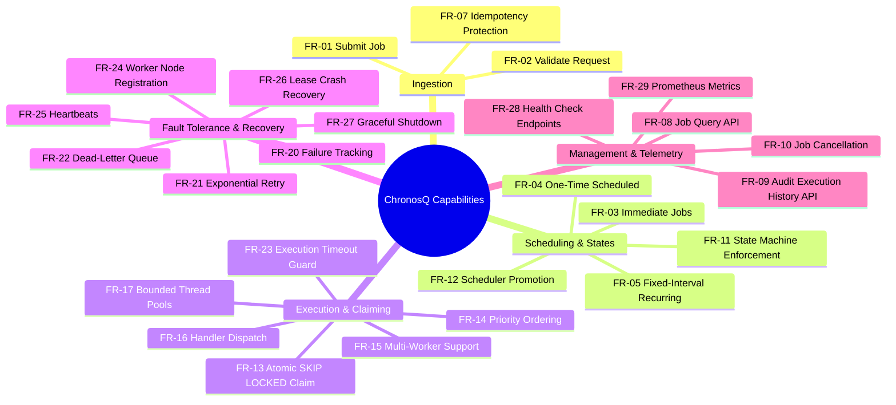
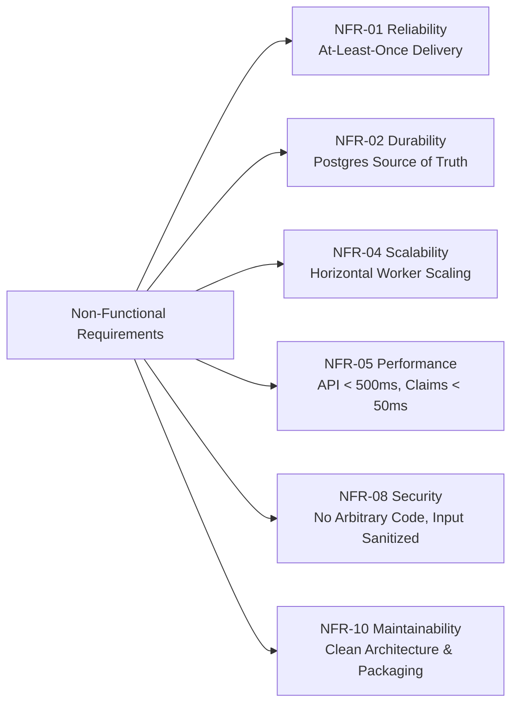

# ChronosQ — Functional and Non-Functional Requirements

> **Document Location:** `docs/REQUIREMENTS.md`  
> **Status:** Formal Specification  
> **Target Framework:** Java 21+ / Spring Boot 3.4+ / PostgreSQL 16+

---

## 1. Purpose & Scope

ChronosQ is a persistent, distributed background-job processing system designed for production environments. It accepts job execution requests via an HTTP REST API, persists them transactionally into PostgreSQL, schedules and claims them using pessimistic row-locking (`SKIP LOCKED`), executes them through registered type-safe Java handlers, automatically retries failed operations using exponential backoff, and recovers orphaned jobs if worker nodes crash.

---

## 2. Functional Requirements (FR)

Functional requirements define the explicit behaviors, operations, and business rules enforced by ChronosQ.



---

### Ingestion & Validation

#### FR-01 — Submit a Job
The system must expose a REST endpoint to accept new background jobs:
```http
POST /api/v1/jobs
Content-Type: application/json
```
**Mandatory Fields:** `queueName`, `jobType`, `payload` (JSON object/node), `scheduleType`.  
**Optional Fields:** `priority` (default 0), `availableAt`, `intervalSeconds`, `maxAttempts` (default 3), `timeoutSeconds` (default 60), `idempotencyKey`.

#### FR-02 — Request Validation & Input Guarding
ChronosQ must validate all incoming requests via Spring Validation before domain processing:
- Reject blank `queueName` or `jobType`.
- Reject empty or non-object `payload`.
- Require `availableAt` if `scheduleType == ONE_TIME`.
- Require `intervalSeconds > 0` if `scheduleType == FIXED_INTERVAL`.
- Reject `maxAttempts < 1` or `priority < 0`.

*Error Response:* HTTP `400 Bad Request` with structured validation errors.

#### FR-07 — Idempotency & Duplicate Prevention
Clients may include an `idempotencyKey` string in the submission payload.
- If a job with the provided `idempotencyKey` already exists, ChronosQ must return the existing job representation with HTTP `200 OK`.
- Database uniqueness on `jobs(idempotency_key)` guarantees zero duplicate creation under high concurrency.

---

### Scheduling & State Machine

#### FR-03 — Immediate Jobs (`IMMEDIATE`)
Jobs submitted with `scheduleType: "IMMEDIATE"` are immediately persisted with status `READY` and `availableAt = NOW()`, making them eligible for instant worker pickup.

#### FR-04 — One-Time Scheduled Jobs (`ONE_TIME`)
Jobs submitted with a future `availableAt` timestamp are persisted with status `SCHEDULED`. They remain unclaimable until `availableAt <= NOW()`.

#### FR-05 — Fixed-Interval Recurring Jobs (`FIXED_INTERVAL`)
Jobs configured with `intervalSeconds` repeat indefinitely. Upon successful completion of an occurrence, ChronosQ automatically schedules the next occurrence at `availableAt = NOW() + intervalSeconds`.

#### FR-06 — Transactional Database Persistence
A job submission must be fully committed to PostgreSQL before returning an HTTP `201 Created` or `200 OK` response to the client.

#### FR-11 — State Machine Enforcement
All job status transitions must pass through `JobStateMachine.canTransition(currentStatus, newStatus)`. Unsanctioned state jumps (e.g., `SUCCEEDED` $\rightarrow$ `RUNNING` or `CANCELLED` $\rightarrow$ `READY`) must throw `InvalidStateTransitionException`.

#### FR-12 — Scheduler Promotion Daemon
The `JobScheduler` daemon runs periodically (default every 1000ms) to scan for due jobs:
```sql
UPDATE jobs SET status = 'READY', updated_at = NOW()
WHERE status IN ('SCHEDULED', 'RETRY_WAIT') AND available_at <= NOW();
```

---

### Distributed Claiming & Execution

#### FR-13 — Atomic Distributed Claiming (`FOR UPDATE SKIP LOCKED`)
Worker nodes must claim `READY` jobs inside a short, dedicated database transaction using row-level locking:
```sql
SELECT id FROM jobs 
WHERE status = 'READY' AND available_at <= NOW()
ORDER BY priority DESC, available_at ASC 
FOR UPDATE SKIP LOCKED LIMIT :batchSize;
```
A successful claim transitions status to `RUNNING`, assigns `locked_by`, sets `lease_expires_at = NOW() + leaseDuration`, increments `attempt_count`, and creates a `job_executions` record.

#### FR-14 — Priority & FIFO Ordering
Claiming must prioritize jobs with higher `priority` numbers first. When priorities are equal, jobs with older `available_at` timestamps are claimed first.

#### FR-15 — Multi-Node Worker Support
N ChronosQ worker instances running across different hosts/containers must process jobs concurrently from the same shared PostgreSQL database without double-claiming or row locking contention.

#### FR-16 — Type-Safe Handler Dispatch
Jobs are executed strictly by Java components implementing `JobHandler` registered in `JobHandlerRegistry`.
- Built-in initial handlers: `PRINT_MESSAGE`, `HTTP_WEBHOOK`.
- Jobs submitted with unregistered `jobType` are rejected during validation or moved to `DEAD_LETTERED` with error `UNKNOWN_JOB_TYPE`.

#### FR-17 — Bounded Resource Management
Worker nodes must use bounded `ThreadPoolTaskExecutor` instances to prevent Out-Of-Memory (OOM) crashes:
- Configurable worker thread count (default: 10 threads).
- Configurable claim batch size (default: 10 jobs per poll).
- Configurable queue capacity (default: 100 tasks).

---

### Execution Auditing & Lifecycle Resolution

#### FR-18 — Execution History Tracking
Every job attempt must create an append-only entry in `job_executions` initialized to `RUNNING`. Upon completion, the execution record updates to `SUCCEEDED`, `FAILED`, `TIMED_OUT`, or `ABANDONED` with exact `started_at`, `finished_at`, `duration_ms`, `error_type`, and `error_message`.

#### FR-19 — Successful Execution Resolution
When a handler finishes execution without exception:
- Mark current execution `SUCCEEDED`.
- Mark job status `SUCCEEDED` and clear `locked_by` and `lease_expires_at`.
- For `FIXED_INTERVAL` jobs, automatically insert the next occurrence as `SCHEDULED`.

#### FR-20 & FR-21 — Failure Handling & Exponential Backoff Retry
When a handler throws an exception during execution:
- Record failure in `job_executions`.
- If `attempt_count < max_attempts`:
  - Calculate exponential retry delay: $Delay = \text{baseSeconds} \times 2^{(\text{attempt}-1)}$.
  - Set `available_at = NOW() + Delay`.
  - Transition job status `RUNNING` $\rightarrow$ `RETRY_WAIT`.
- When `available_at` arrives, the `JobScheduler` promotes the job `RETRY_WAIT` $\rightarrow$ `READY`.

#### FR-22 — Dead-Letter Queue (DLQ) Exhaustion
If `attempt_count >= max_attempts` upon failure:
- Transition job status `RUNNING` $\rightarrow$ `DEAD_LETTERED`.
- Stop automatic retries. Retain job payload and full execution history for administrative inspection and manual retry.

#### FR-23 — Execution Timeout Enforcement
If a job handler execution exceeds `timeoutSeconds`:
- Interrupt the executing thread via `Future.cancel(true)`.
- Mark execution `TIMED_OUT`.
- Initiate retry backoff or DLQ transition according to attempt count.

---

### Node Registration & Crash Recovery

#### FR-24 — Worker Registration
On boot, every ChronosQ worker instance registers itself in `worker_nodes` with its `worker_id`, host IP/hostname, and startup timestamp.

#### FR-25 — Worker Heartbeats
Active workers periodically execute heartbeats (default every 5s) updating `last_heartbeat_at` in `worker_nodes` and extending active leases (`lease_expires_at = NOW() + 30s`) in `jobs`.

#### FR-26 — Crash Recovery Daemon (`WorkerRecoveryService`)
A background daemon scans for orphaned executions where `status = 'RUNNING'` and `lease_expires_at < NOW()`:
- Mark dead execution as `ABANDONED`.
- Reset job to `RETRY_WAIT` (if attempts remain) or `DEAD_LETTERED` (if attempts exhausted).

#### FR-27 — Graceful Shutdown
On `SIGTERM` / `SIGINT`:
- Stop accepting new HTTP requests and pause job claiming.
- Allow active executing threads up to `gracefulShutdownTimeout` (default 30s) to complete.
- Unregister node from `worker_nodes`.

---

### Management & Telemetry API

#### FR-08 — Job Query Endpoint
```http
GET /api/v1/jobs/{jobId}
```
Returns full job state, payload, current status, attempt counts, schedule details, and timestamps. Returns `404 Not Found` if missing.

#### FR-09 — Execution Audit History Endpoint
```http
GET /api/v1/jobs/{jobId}/executions
```
Returns array of all execution attempts for the job ordered by `attempt_number ASC`.

#### FR-10 — Job Cancellation Endpoint
```http
POST /api/v1/jobs/{jobId}/cancel
```
Cancels non-terminal jobs (`SCHEDULED`, `READY`, `RETRY_WAIT` $\rightarrow$ `CANCELLED`). Rejects cancellation of terminal jobs (`SUCCEEDED`, `DEAD_LETTERED`, `CANCELLED`) with `409 Conflict`.

#### FR-28 — Health Check Endpoints
Expose standard health indicators at `/actuator/health` and `/actuator/info` verifying PostgreSQL database connectivity and worker thread pool status.

#### FR-29 — Metrics & Observability Endpoint
Expose Micrometer Prometheus metrics at `/actuator/prometheus`.

---

## 3. Non-Functional Requirements (NFR)

Non-functional requirements specify quality attributes, performance targets, security standards, and operational constraints.



---

### Detailed NFR Specifications

| ID | Category | Requirement Description & Acceptance Criteria |
|---|---|---|
| **NFR-01** | **Reliability** | **At-Least-Once Execution Guarantee:** Jobs accepted by ChronosQ will never be silently dropped or lost. In worker crash scenarios, duplicate execution may occur; job handlers MUST be implemented idempotently. |
| **NFR-02** | **Durability** | **PostgreSQL Persistence:** All accepted jobs, execution records, and state transitions are transactionally persisted to PostgreSQL. Data survives process restarts, container redeployments, and host crashes. |
| **NFR-03** | **Data Consistency** | **ACID Transactions & Locking:** State mutations must use database transactions, foreign key constraints, unique indexes (`idempotency_key`), and optimistic/pessimistic row locking to eliminate race conditions. |
| **NFR-04** | **Horizontal Scalability** | **Shared-Database Cluster:** Adding more ChronosQ instances must increase system throughput linearly without requiring worker-to-worker communication protocols (peer discovery or cluster consensus). |
| **NFR-05** | **Performance** | **Response & Latency Targets:**<br>• Job ingestion API (`POST /jobs`) latency $< 500\text{ms}$ at 99th percentile.<br>• Claim transactions $< 50\text{ms}$.<br>• Scheduled promotion lag $< 2 \times \text{pollingInterval}$. |
| **NFR-06** | **Backpressure** | **Memory Protection:** Applications must use bounded thread pools and bounded in-memory queues. The database serves as the primary backpressure buffer. |
| **NFR-07** | **Availability** | **Fault Isolation:** Failure of any single worker node must not disrupt processing on peer nodes. If PostgreSQL becomes temporarily unreachable, nodes auto-reconnect upon recovery. |
| **NFR-08** | **Security** | **Sandboxed & Safe Processing:**<br>• No arbitrary Java code execution.<br>• Parameterized SQL queries via Spring Data JPA / JDBC Template.<br>• Sensitive payload headers (e.g., Auth tokens) masked in logs. |
| **NFR-09** | **Observability** | **Structured Logging & Telemetry:** All logs must contain MDC fields: `jobId`, `executionId`, `workerId`, `jobType`, `attemptNumber`. Expose standard Micrometer metrics for Prometheus scraping. |
| **NFR-10** | **Maintainability** | **Package Isolation:** Strict architectural package boundaries (`api`, `job`, `scheduler`, `worker`, `execution`, `handler`, `recovery`, `metrics`, `config`). |
| **NFR-11** | **Testability** | **Comprehensive Automated Testing:** Core state machine unit tests, Mockito service tests, Testcontainers integration tests against real PostgreSQL instances, and concurrent multi-worker claim tests. |
| **NFR-12** | **Configurability** | **Externalized Configuration:** All operational parameters (DB pool size, thread pool capacity, polling intervals, lease durations) configurable via environment variables (`application.yml`). |
| **NFR-13** | **Time Consistency** | **UTC Standard:** All timestamps stored as `TIMESTAMPTZ` in PostgreSQL, represented as `Instant` in Java, and serialized as ISO-8601 UTC strings (`2026-08-01T10:00:00Z`). |
| **NFR-14** | **Portability** | **Container Readiness:** Runs on Java 21+ and PostgreSQL 16+, packaged as an executable fat JAR or standard OCI container image. |
| **NFR-15** | **Graceful Failure** | **Standardized API Errors:** API errors return RFC-7807 compliant error payloads with timestamps, HTTP status codes, error codes, and messages without exposing internal stack traces. |
| **NFR-16** | **Documentation** | **Comprehensive Docs:** Maintain full `docs/WORKFLOW.md`, `docs/REQUIREMENTS.md`, and updated `README.md`. |

---

## 4. Out of Scope for Initial Version

The following features are intentionally deferred for subsequent releases:

1. Executing arbitrary client-submitted code scripts (Python, JS, dynamic bytecode).
2. Exactly-once execution guarantees (fundamentally impossible over distributed networks without two-phase commit downstream).
3. Web-based graphical UI dashboard (metrics covered via Prometheus / Grafana).
4. Complex Cron-expression parsing (e.g., `0 0 12 * * ?` — initial release uses fixed intervals in seconds).
5. Automatic dead-letter job replay daemons (manual REST trigger only).
6. Multi-region database replication/coordination.

---

## 5. Requirements Summary Checklist

```text
[✓] Persistent        - PostgreSQL transaction log backing
[✓] Distributed       - Multi-worker row locking (SKIP LOCKED)
[✓] Concurrency Safe  - Atomic state machine transitions
[✓] Resilient         - Backoff retries & zombie lease recovery
[✓] Observable        - Actuator, Prometheus metrics & MDC logs
[✓] Testable          - Unit & Testcontainers integration suite
```
