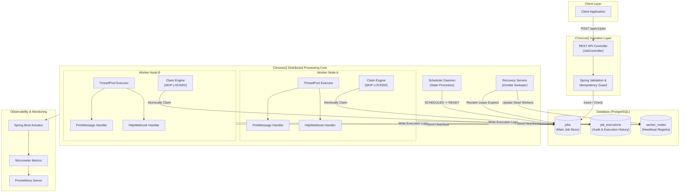
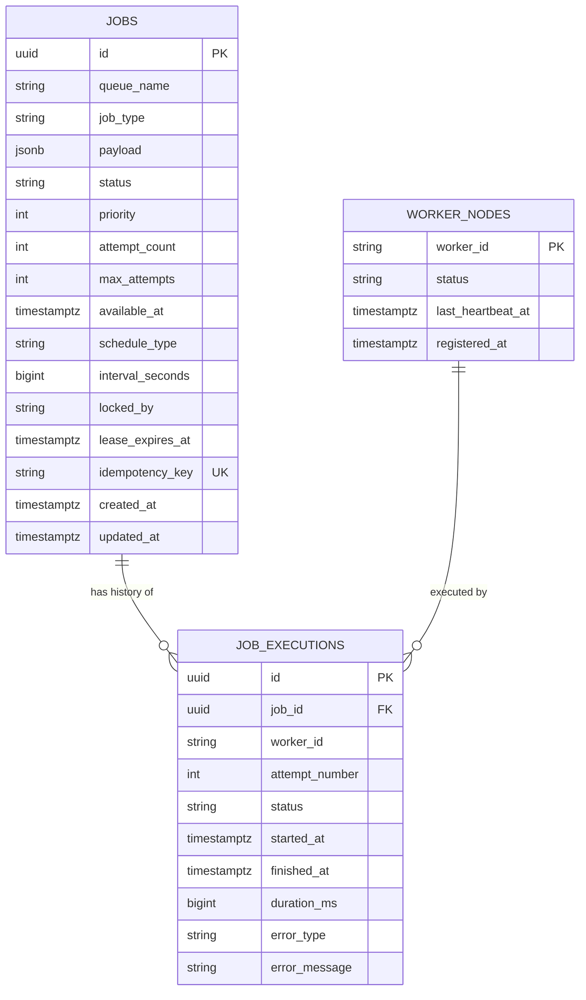
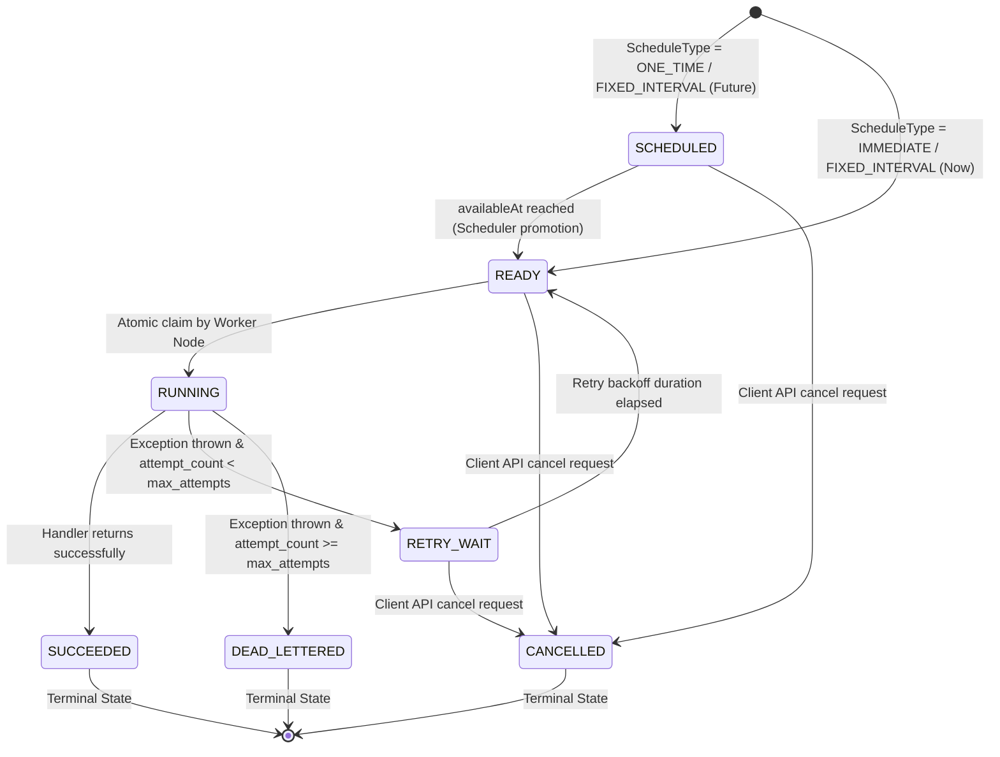
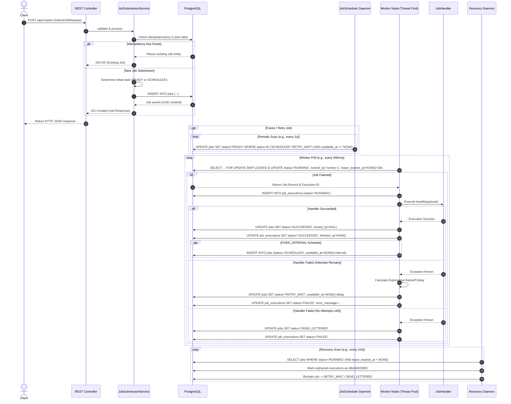

# ChronosQ — Complete Project Workflow & System Architecture

> **Document Location:** `docs/WORKFLOW.md`  
> **Status:** Architecture Reference & Specification  
> **Target Framework:** Java 21+ / Spring Boot 3.4+ / PostgreSQL 16+

---

## 1. Executive Summary & Core Value Proposition

**ChronosQ** is a high-performance, persistent, distributed background-job processing system engineered with Spring Boot and PostgreSQL. It enables client applications to offload asynchronous, scheduled, and recurring workloads safely and reliably.

### Key Capabilities
- **Persistence:** Jobs survive application restarts, deployments, and infrastructure outages because the canonical state is stored transactionally in PostgreSQL.
- **Distributed Coordination:** Multiple ChronosQ worker nodes operate concurrently in a clustered environment without duplicate job processing or split-brain anomalies, using PostgreSQL's `FOR UPDATE SKIP LOCKED`.
- **Fault Tolerance & Self-Healing:** Automatic crash recovery, lease monitoring, abandoned job detection, and exponential backoff retry mechanisms guarantee **at-least-once execution**.
- **Flexibility:** Supports **Immediate**, **One-Time Scheduled** (future timestamp), and **Fixed-Interval Recurring** execution models with dynamic `JSONB` payloads.

---

## 2. System Architecture

ChronosQ uses PostgreSQL as its central message store and coordination backbone. Worker instances do not require peer-to-peer network discovery or external consensus clusters (such as ZooKeeper or Redis); all synchronization is achieved transactionally via the database.



---

## 3. Database Schema Architecture

ChronosQ relies on three primary tables designed for optimal lock concurrency, high throughput, and complete historical auditability.



### Table Specifications

#### 1. `jobs`
The core state table representing pending, active, and completed jobs.

```sql
CREATE TABLE jobs (
    id UUID PRIMARY KEY DEFAULT gen_random_uuid(),
    queue_name VARCHAR(100) NOT NULL DEFAULT 'default',
    job_type VARCHAR(100) NOT NULL,
    payload JSONB NOT NULL,
    status VARCHAR(30) NOT NULL,
    priority INTEGER NOT NULL DEFAULT 0,
    attempt_count INTEGER NOT NULL DEFAULT 0,
    max_attempts INTEGER NOT NULL DEFAULT 3,
    available_at TIMESTAMPTZ NOT NULL,
    schedule_type VARCHAR(30) NOT NULL,
    interval_seconds BIGINT,
    locked_by VARCHAR(100),
    lease_expires_at TIMESTAMPTZ,
    idempotency_key VARCHAR(255) UNIQUE,
    created_at TIMESTAMPTZ NOT NULL DEFAULT NOW(),
    updated_at TIMESTAMPTZ NOT NULL DEFAULT NOW()
);

-- Critical Index for High-Performance Claiming
CREATE INDEX idx_jobs_claim 
ON jobs (status, priority DESC, available_at ASC) 
WHERE status = 'READY';

-- Index for Scheduler Scanning
CREATE INDEX idx_jobs_scheduled 
ON jobs (available_at) 
WHERE status = 'SCHEDULED';
```

#### 2. `job_executions`
Append-only execution ledger recording every attempt made by any worker node.

```sql
CREATE TABLE job_executions (
    id UUID PRIMARY KEY DEFAULT gen_random_uuid(),
    job_id UUID NOT NULL REFERENCES jobs(id) ON DELETE CASCADE,
    worker_id VARCHAR(100) NOT NULL,
    attempt_number INTEGER NOT NULL,
    status VARCHAR(30) NOT NULL,
    started_at TIMESTAMPTZ NOT NULL,
    finished_at TIMESTAMPTZ,
    duration_ms BIGINT,
    error_type VARCHAR(100),
    error_message TEXT
);

CREATE INDEX idx_executions_job_id ON job_executions(job_id);
```

#### 3. `worker_nodes`
Tracks cluster membership and node liveness via periodic heartbeats.

```sql
CREATE TABLE worker_nodes (
    worker_id VARCHAR(100) PRIMARY KEY,
    status VARCHAR(30) NOT NULL,
    last_heartbeat_at TIMESTAMPTZ NOT NULL,
    registered_at TIMESTAMPTZ NOT NULL DEFAULT NOW()
);
```

---

## 4. State Machine & Transition Rules

Job execution states follow strict deterministic lifecycle rules.



### State Matrix & Transition Guard Table

| Current State | Target State | Trigger / Condition | Validated By |
|---|---|---|---|
| `-` | `SCHEDULED` | Created with future `availableAt` | `JobSubmissionService` |
| `-` | `READY` | Created for immediate execution | `JobSubmissionService` |
| `SCHEDULED` | `READY` | `availableAt <= NOW()` | `JobScheduler` |
| `SCHEDULED` | `CANCELLED` | API request `/jobs/{id}/cancel` | `JobCancellationService` |
| `READY` | `RUNNING` | Atomically locked via `SKIP LOCKED` | `DistributedClaimEngine` |
| `READY` | `CANCELLED` | API request `/jobs/{id}/cancel` | `JobCancellationService` |
| `RUNNING` | `SUCCEEDED` | Job handler finishes cleanly | `JobExecutionEngine` |
| `RUNNING` | `RETRY_WAIT` | Handler failure & attempts remain | `JobExecutionEngine` |
| `RUNNING` | `DEAD_LETTERED` | Handler failure & attempts exhausted | `JobExecutionEngine` |
| `RUNNING` | `RETRY_WAIT` | Lease expired & worker crashed | `WorkerRecoveryService` |
| `RETRY_WAIT` | `READY` | Backoff delay elapsed (`availableAt <= NOW()`) | `JobScheduler` |
| `RETRY_WAIT` | `CANCELLED` | API request `/jobs/{id}/cancel` | `JobCancellationService` |

*Note: Terminal states (`SUCCEEDED`, `DEAD_LETTERED`, `CANCELLED`) are immutable and block any further status changes.*

---

## 5. End-to-End Deep-Dive Workflow



---

## 6. Step-by-Step Technical Breakdown

### Step 1: Client Job Submission
Clients interact with ChronosQ via REST endpoints:

```http
POST /api/v1/jobs
Content-Type: application/json

{
  "queueName": "notifications",
  "jobType": "HTTP_WEBHOOK",
  "payload": {
    "url": "https://api.partner.com/webhooks/order-fulfilled",
    "method": "POST",
    "headers": { "Authorization": "Bearer token-xyz" },
    "body": { "orderId": "ORD-99823", "status": "COMPLETED" }
  },
  "priority": 10,
  "scheduleType": "IMMEDIATE",
  "maxAttempts": 5,
  "timeoutSeconds": 60,
  "idempotencyKey": "webhook-ord-99823-v1"
}
```

---

### Step 2: Request Validation
Spring’s `@Valid` annotation and custom validators enforce strict domain rules before processing:

```java
public record SubmitJobRequest(
    @NotBlank String queueName,
    @NotBlank String jobType,
    @NotNull JsonNode payload,
    @Min(0) @Max(100) int priority,
    @NotNull ScheduleType scheduleType,
    Instant availableAt,
    Long intervalSeconds,
    @Min(1) @Max(25) int maxAttempts,
    @Min(1) @Max(3600) int timeoutSeconds,
    String idempotencyKey
) {}
```

**Validation Guards:**
- If `scheduleType == ONE_TIME`, `availableAt` is **required** and must be in the future.
- If `scheduleType == FIXED_INTERVAL`, `intervalSeconds` is **required** and must be $> 0$.
- Missing or malformed payloads reject immediately with `400 Bad Request`.

---

### Step 3: Idempotency Guarantee
Network issues can cause client retries. ChronosQ prevents duplicate job creation via `idempotencyKey`:

1. The service checks the `jobs` table for `idempotency_key = :key`.
2. If found, the existing job representation is returned with `200 OK`.
3. If not found, insertion proceeds. A database `UNIQUE` constraint guarantees zero race conditions across concurrent API nodes.

---

### Step 4 & 5: State Determination & Persistence
`JobSubmissionService` sets the initial status:

- `IMMEDIATE` $\rightarrow$ `READY`, `availableAt = NOW()`
- `ONE_TIME` $\rightarrow$ `SCHEDULED`, `availableAt = request.availableAt`
- `FIXED_INTERVAL` $\rightarrow$ `READY` (if initial run is immediate) or `SCHEDULED`

The `payload` is converted into a native PostgreSQL `JSONB` structure, providing schema flexibility and indexing capability without requiring schema alterations for new job types.

---

### Step 6: Scheduler Promotion Loop
A background daemon (`JobScheduler`) periodically promotes due jobs:

```sql
UPDATE jobs
SET status = 'READY',
    updated_at = NOW()
WHERE status IN ('SCHEDULED', 'RETRY_WAIT')
  AND available_at <= NOW();
```

*Analogy:* The scheduler acts as an alarm clock—it does not execute the work, but flags the job as ready for workers.

---

### Step 7: Distributed Claiming via `FOR UPDATE SKIP LOCKED`
When workers query for work, concurrent lock contention is completely eliminated using PostgreSQL's native row-level skip-locking mechanism:

```sql
WITH candidate_jobs AS (
    SELECT id
    FROM jobs
    WHERE status = 'READY'
      AND available_at <= NOW()
    ORDER BY priority DESC, available_at ASC
    FOR UPDATE SKIP LOCKED
    LIMIT :batchSize
)
UPDATE jobs j
SET status = 'RUNNING',
    locked_by = :workerId,
    lease_expires_at = NOW() + INTERVAL '30 seconds',
    attempt_count = j.attempt_count + 1,
    updated_at = NOW()
FROM candidate_jobs c
WHERE j.id = c.id
RETURNING j.*;
```

**Why `SKIP LOCKED` is critical:**
- Worker A locks Job 1.
- Worker B attempts to fetch jobs; instead of blocking on Job 1, it silently **skips** Job 1 and instantly claims Job 2.
- Scales linearly as worker nodes are added without database lock waits or deadlocks.

---

### Step 8: Lease Engine & Heartbeat Mechanism
When a worker claims a job, it receives temporary ownership bound by a **lease** (`lease_expires_at`).

- **Heartbeat Loop:** While a job handler executes long-running tasks, a supervisor thread sends heartbeats every 5 seconds, extending `lease_expires_at = NOW() + 30s`.
- **Node Heartbeat:** Every active worker node updates its record in `worker_nodes` every 5 seconds.

---

### Step 9 & 10: Worker Thread Pool & Execution Engine
Each worker node maintains a bounded thread pool (`ThreadPoolTaskExecutor`) to isolate job executions:

```java
@Component
public class JobExecutionEngine {
    private final Map<String, JobHandler> handlerRegistry;
    private final TaskExecutor workerThreadPool;

    public void dispatch(Job job) {
        JobHandler handler = handlerRegistry.get(job.getJobType());
        if (handler == null) {
            handleMissingHandler(job);
            return;
        }
        workerThreadPool.execute(() -> executeJob(job, handler));
    }
}
```

---

### Step 11: Successful Execution
When `JobHandler.execute(payload)` completes without exceptions:
1. `job_executions` record transitions to `SUCCEEDED` with `finished_at` and `duration_ms`.
2. `jobs` record transitions to `SUCCEEDED`, and lease locks (`locked_by`, `lease_expires_at`) are cleared.
3. For `FIXED_INTERVAL` jobs, ChronosQ calculates the next occurrence (`NOW() + intervalSeconds`) and inserts a new job record with state `SCHEDULED`.

---

### Step 12: Failure & Exponential Backoff Retry
If a job handler throws an uncaught exception:
1. Execution status records as `FAILED` with `error_type` and full stacktrace summary in `error_message`.
2. If `attempt_count < max_attempts`:
   - Calculate retry delay using exponential backoff with jitter:
     $$\text{Delay} = \text{BaseDelay} \times 2^{(\text{attempt} - 1)} + \text{Jitter}$$
   - Update job status to `RETRY_WAIT` and set `available_at = NOW() + Delay`.

---

### Step 13: Dead-Letter Queue (DLQ)
When `attempt_count >= max_attempts`:
- The job transitions to `DEAD_LETTERED`.
- Automatic retries stop.
- Administrators can inspect the failure history, inspect the `JSONB` payload, fix underlying issues, and manually retrigger the job via `/api/v1/jobs/{id}/retry`.

---

### Step 14: Crash Recovery & Zombie Sweeper
If a worker node crashes mid-execution (power failure, OOM killed, network partition):
1. Its heartbeats stop and `lease_expires_at` passes.
2. The `WorkerRecoveryService` daemon sweeps for orphaned jobs:

```sql
SELECT * FROM jobs 
WHERE status = 'RUNNING' 
  AND lease_expires_at < NOW();
```

3. The active execution record is marked as `ABANDONED`.
4. If attempts remain, the job is reset to `RETRY_WAIT` $\rightarrow$ `READY` for another healthy worker node to pick up.

---

### Step 15: At-Least-Once Execution Guarantee
Because network partitions or crashes can happen between external side-effects (e.g., sending an HTTP webhook) and DB state commit, ChronosQ guarantees **at-least-once execution**.

**Handler Idempotency Recommendation:**
External side-effects should embed the ChronosQ `jobId` or `idempotencyKey` in downstream payloads (e.g., `X-ChronosQ-Job-Id: 8b56a983...`). Receiver systems can use this ID to deduplicate requests.

---

### Step 16: Job Cancellation Workflow
Clients can cancel non-terminal jobs:

```http
POST /api/v1/jobs/{jobId}/cancel
```

- Allowed from: `SCHEDULED`, `READY`, `RETRY_WAIT`.
- Forbidden from: `SUCCEEDED`, `DEAD_LETTERED`, `CANCELLED` (returns `409 Conflict`).
- Running job cancellation triggers cooperative interruption flags via `Future.cancel(true)` if supported by the handler.

---

### Step 17: Query & Audit API

#### Fetch Job Details
```http
GET /api/v1/jobs/8b56a983-7862-48e3-bb5c-746621344441
```

#### Fetch Execution Audit History
```http
GET /api/v1/jobs/8b56a983-7862-48e3-bb5c-746621344441/executions
```

```json
[
  {
    "attemptNumber": 1,
    "status": "FAILED",
    "workerId": "worker-node-alpha",
    "startedAt": "2026-08-01T10:00:00Z",
    "finishedAt": "2026-08-01T10:00:02Z",
    "durationMs": 2014,
    "errorType": "java.net.ConnectException",
    "errorMessage": "Connection refused to remote webhook target"
  },
  {
    "attemptNumber": 2,
    "status": "SUCCEEDED",
    "workerId": "worker-node-beta",
    "startedAt": "2026-08-01T10:00:10Z",
    "finishedAt": "2026-08-01T10:00:10.450Z",
    "durationMs": 450,
    "errorType": null,
    "errorMessage": null
  }
]
```

---

## 7. Metrics & Observability

ChronosQ exposes real-time operational metrics via **Spring Boot Actuator** and **Micrometer Prometheus registry** at `/actuator/prometheus`.

| Metric Name | Type | Description |
|---|---|---|
| `chronosq_jobs_submitted_total` | Counter | Total jobs submitted categorized by queue and job type |
| `chronosq_jobs_succeeded_total` | Counter | Total successfully processed jobs |
| `chronosq_jobs_failed_total` | Counter | Total failed job execution attempts |
| `chronosq_jobs_dead_lettered_total` | Counter | Total jobs moved to Dead Letter Queue |
| `chronosq_queue_depth` | Gauge | Number of jobs currently in `READY` state |
| `chronosq_execution_duration_seconds` | Summary / Timer | Execution latency histogram per `jobType` |
| `chronosq_active_workers` | Gauge | Count of live worker nodes emitting heartbeats |

---

## 8. Development Implementation Roadmap

| Phase | Milestone Name | Scope & Key Deliverables |
|---|---|---|
| **Phase 1** | Foundation & Infrastructure | Project structure, PostgreSQL Docker Compose setup, Flyway migrations base. |
| **Phase 2** | Domain & Persistence | Core JPA Entities (`Job`, `JobExecution`), `JobStatus` Enum, `JobStateMachine`. |
| **Phase 3** | Ingestion & REST API | `SubmitJobRequest` DTOs, `JobSubmissionService`, Idempotency check, REST endpoints. |
| **Phase 4** | Scheduling Engine | `JobScheduler` background daemon for `SCHEDULED` $\rightarrow$ `READY` promotions. |
| **Phase 5** | Distributed Claiming | `FOR UPDATE SKIP LOCKED` query implementation, Atomic claim transaction logic. |
| **Phase 6** | Worker Engine | Thread pool management (`ThreadPoolTaskExecutor`), `JobExecutionEngine`, lease heartbeats. |
| **Phase 7** | Built-in Handlers | `PRINT_MESSAGE` and `HTTP_WEBHOOK` job handler implementations. |
| **Phase 8** | Fault Tolerance & Recovery | Exponential backoff retries, DLQ handling, `WorkerRecoveryService` zombie sweeper. |
| **Phase 9** | Metrics & Telemetry | Micrometer Prometheus counters, Actuator health indicators, MDC logging context. |
| **Phase 10** | End-to-End & Load Testing | Integration tests with Testcontainers, multi-node concurrency verification. |

> **Current Implementation Status:** Immediately following Phase 3 DTO and mapping implementation. Next step: Completing `JobSubmissionService` validation and service orchestration.
